# SFRA Labs

**Table of context (SFRA Labs):**
- [SFRA Labs](#SFRA-Labs)
  - [Storefront Reference Architecture - SFRA](#Storefront-Reference-Architecture---SFRA)
  - [Global Development Strategy for SFRA Projects - WIP](#Global-Development-Strategy-for-SFRA-Projects---WIP)
  - [Developing with Commerce Cloud Storefront Reference Architecture](#Developing-with-Commerce-Cloud-Storefront-Reference-Architecture)
  - [Storefront Reference Architecture - Technical Deep Dive:](#Storefront-Reference-Architecture---Technical-Deep-Dive)
  - [Setting Up and Installing SFRA](#Setting-Up-and-Installing-SFRA)
  - [Configure DwithEasy Extension for Chrome](#Configure-DwithEasy-Extension-for-Chrome)
  - [Lab1: Creating the Hello Controller](#Lab1-Creating-the-Hello-Controller)
  - [Lab2: Finding an Error on a Controller](#Lab2-Finding-an-Error-on-a-Controller)
  - [Lab3: Using the Controller Debugger](#Lab3-Using-the-Controller-Debugger)
  - [Lab4: Controllers extend](#Lab4-Controllers-extend)
  - [Lab5: Templates](#Lab5-Templates)
  - [Lab6: Script Debugging](#Lab6-Script-Debugging)
  - [Lab7: Reusing Code with a Decorator](#Lab7-Reusing-Code-with-a-Decorator)
  - [Lab6: Reusing Code with a Local Include](#Lab6-Reusing-Code-with-a-Local-Include)
  - [Lab8: Middleware](#Lab8-Middleware)
  - [Lab9: Models and js decorators](#Lab9-Models-and-js-decorators)
  - [Lab10: Creating Social Networks Links](#Lab10-Creating-Social-Networks-Links)
  - [Lab11: Using Page Level Caching](#Lab11-Using-Page-Level-Caching)
  - [Lab12: SFRA Forms](#Lab12-SFRA-Forms)
  - [Lab13: ClickStream](#Lab13-ClickStream)
- [Lab14: server.replace](#Lab14-serverreplace)


## Storefront Reference Architecture - SFRA
[Learn more](https://confluence.ontrq.com/display/ACDC/Storefront+Reference+Architecture+-+SFRA)

## Global Development Strategy for SFRA Projects - WIP

[Learn more](https://confluence.ontrq.com/pages/viewpage.action?spaceKey=ACDC&title=Global+Development+Strategy+for+SFRA+Projects+-+WIP#GlobalDevelopmentStrategyforSFRAProjects-WIP-res)

## Developing with Commerce Cloud Storefront Reference Architecture

[Watch Video](https://demandwaretraining.docebosaas.com/learn/course/91/Developing%2520with%2520Commerce%2520Cloud%2520Storefront%2520Reference%2520Architecture)

## Storefront Reference Architecture - Technical Deep Dive:
[Watch Video](http://salesforce.vidyard.com/watch/ehBFfZBd2PxcbaivjMJHE5)****


## Setting Up and Installing SFRA

The SFRA (Storefront Reference Architecture) reference application provides two sample sites:

- RefArch
- RefArchGlobal

SFRA also provides associated data and code to drive the sample ecommerce storefront.

The SFRA reference application represents Commerce Cloud's current recommended approach for implementing digital storefronts. If you're creating a site, use the SFRA reference application as a starting point.

To get started with SFRA, you have to perform some preliminary steps:

1. Set up your environment in VS CODE. 
Install VS Code and add this [extension](https://marketplace.visualstudio.com/items?itemName=SqrTT.prophet) for uploading cartridges to your instance.
2. If you don’t already have a GitHub account, create one on [Github](https://github.com/) 
3. [Enable](https://docs.github.com/en/github/authenticating-to-github/configuring-two-factor-authentication) Two-Factor Authentication for your GitHub account
4. Navigate to the XChange User Community [Profile](https://cc-community-authmgr.herokuapp.com/), and log in with Account Manager credentials. If you have an active session on XChange, you might be logged in automatically.
5. On the left side, select Github. Follow the steps on the screen to authenticate, link your GitHub account, and request access.
6. At the bottom, click Visit Commerce Cloud on Github.
7. At the top, click View Invitation. Accept the invitation. You now have access to the Salesforce CommerceCloud repositories on GitHub.
8. Search for the following repositories, and click Clone or download to copy each repository to your local system.
9. Download SFRA base structure from [github](https://github.com/SalesforceCommerceCloud/storefront-reference-architecture)
10. Import [data](https://github.com/SalesforceCommerceCloud/storefrontdata) to your instance 
11. Install and configure SFRA [Tools](https://documentation.b2c.commercecloud.salesforce.com/DOC2/topic/com.demandware.dochelp/content/b2c_commerce/topics/sfra/b2c_installing_and_configuring_sfra_build_tools.html?cp=0_5_3_2_1)
12. [Build](https://documentation.b2c.commercecloud.salesforce.com/DOC2/topic/com.demandware.dochelp/content/b2c_commerce/topics/sfra/b2c_building_sfra.html?cp=0_5_3_2_2) the site 
13. [Upload](https://documentation.b2c.commercecloud.salesforce.com/DOC2/topic/com.demandware.dochelp/content/b2c_commerce/topics/sfra/b2c_uploading_code.html?cp=0_5_3_2_3) code to the sandbox
14. [Configure](https://documentation.b2c.commercecloud.salesforce.com/DOC2/topic/com.demandware.dochelp/content/b2c_commerce/topics/sfra/b2c_configuring_sfra.html?cp=0_5_3_3) the site.
15. [Customizing](https://documentation.b2c.commercecloud.salesforce.com/DOC2/topic/com.demandware.dochelp/content/b2c_commerce/topics/sfra/b2c_customizing_sfra.html?cp=0_5_3_4) SFRA 

After your environment is set up, you can run the SFRA reference application and explore how it is constructed.


## Configure DwithEasy Extension for Chrome

1. Follow this [link](https://forkpoint.com/products/dwithease/) and click "ADD TO GOOGLE CHROME" button to install extension. 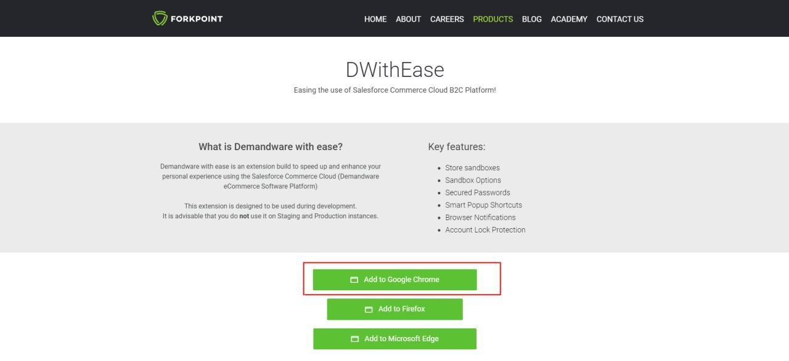
2. In the chrome web store click "Add to Chrome" button 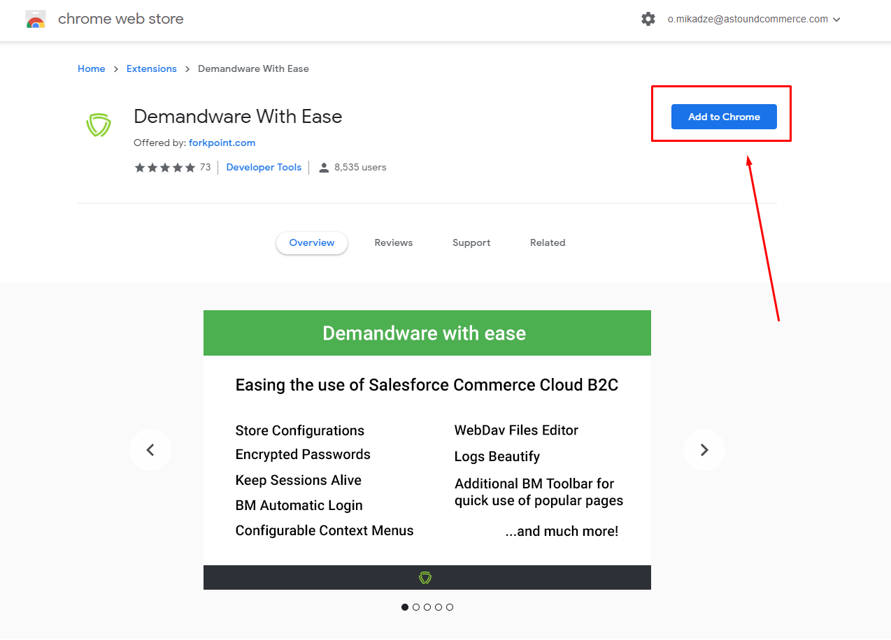
3. 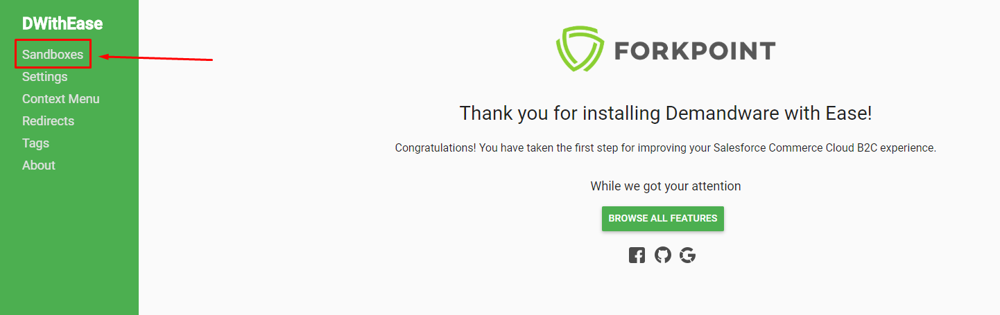
4. 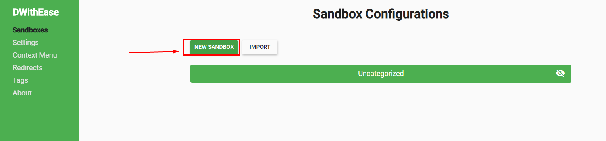
5. Fill the form and click Save
   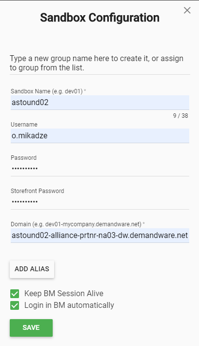
6. Now you can navigate to your Chrome extnesions, find the DWithEasy logo and work with your sandbox.


## Lab1: Creating the Hello Controller

In this lab we are going to create a simple controller which returns us template with custom object we created.

**1. Create Hello.js controller**

Navigate to your custom cartridge ( [here](https://documentation.b2c.commercecloud.salesforce.com/DOC2/topic/com.demandware.dochelp/content/b2c_commerce/topics/sfra/b2c_adding_custom_cartridges.html?resultof=%22%63%61%72%74%72%69%64%67%65%22%20%22%63%61%72%74%72%69%64%67%22%20)  you can find guide how to add custom cartridges) (in my case it's "*app_custom_storefront*") and create *Hello.js* controller.

- *your_cartridge_name/cartridge/controllers/Hello.js*

```javascript
'use strict';

var server = require('server');


server.get('Show', function (req, res, next) { //creating a simple endpoint which you can find by https://localhost/on/demandware.store/Sites-RefArch-Site/default/Hello-Show and registers the Show route for the Home module
    var renderingData = {
        name: 'testname',
        email: 'testemail@astoundcommerce.com',
        type: 'object'
    }
    res.render('hello/helloTemplate', {renderingData: renderingData}); // returning in the response template 'hello/helloTemplate' with renderingData
    next();//notifies middleware chain that it can move to the next step or terminate if this is the last step.
});

module.exports = server.exports();
```


**2. Create template helloTemplate.isml**

Navigate to *your_cartridge_name/cartridge/templates/dafault/hello* folder and create helloTemplate.isml file.

- *your_cartridge_name/cartridge/templates/dafault/hello/helloTemplate*

```html

<iscontent type="text/html" charset="UTF-8" compact="true" />

<html>
    <head>
        <title>${ Resource.msg('title', <bundleName>, <defaultMessage>) }</title>
    </head>
    <body>
        <span> ${JSON.stringify(pdict.testObject)} </span>
    </body>
</html>
```

Learn how to work with properties files [here](https://documentation.b2c.commercecloud.salesforce.com/DOC2/topic/com.demandware.dochelp/DWAPI/scriptapi/html/api/class_dw_web_Resource.html?resultof=%22%52%65%73%6f%75%72%63%65%22%20%22%72%65%73%6f%75%72%63%22%20)

**3. Check your endpoint in browser**
Go to *https://your-sandbox-name-dw.demandware.net/on/demandware.store/Sites-RefArch-Site/default/Hello-Show* in your browser. And check or it works.
**Do not forget to change url with your sandbox name**

**4. If all works commit and push it to your branch**


## Lab2: Finding an Error on a Controller

If you had any errors in [Lab1](#Lab1-Creating-the-Hello-Controller) you can find their description in [Log Files](https://documentation.b2c.commercecloud.salesforce.com/DOC2/topic/com.demandware.dochelp/content/b2c_commerce/topics/storefront_toolkit/b2c_sftk_container.html) in two places: 

**1. Request Log** in [Storefront Toolkit](https://documentation.b2c.commercecloud.salesforce.com/DOC2/index.jsp?topic=%2Fcom.demandware.dochelp%2Fcontent%2Fb2c_commerce%2Ftopics%2Fstorefront_toolkit%2Fb2c_sftk_container.html) in top-left corner of your site page


**2. DWithEase browser extension** we installed before.
   1. Click DWithEase extension icon in your browser
   2. Click burger icon in front of your instance you need
   3. Click LOGS

   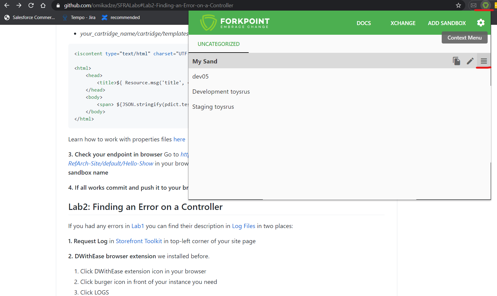

Here you can find latest logs files sorting them by different filters at the top (time, name, size, last modifications)

   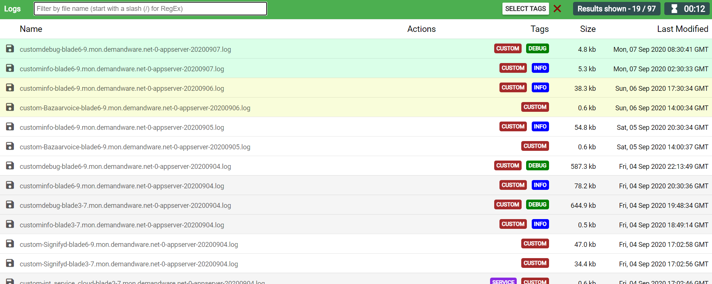

**3. From Business Manager**

Besides you can find Request Logs in Business Manager, by pressing Toolkit at the top, and then Request Log icon

   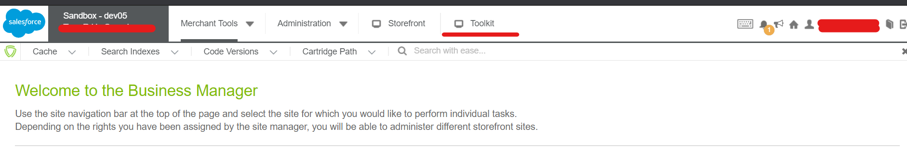

   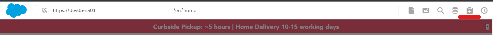


This log files display log entries related to the most recent request to the server from the storefront. Log entries related to requests to the server made while the Request Log is open are also displayed.

## Lab3: Using the Controller Debugger

This lab is about using debugger to debug controller execution. For this you need to create a controller, which gets the product by its ID, to create a Debug Configuration, start a Debugging Session and troubleshoot Debug Sessions. Please keep in mind, that described below debugger will work only for backend controllers, but not for frontend JS components.

**Important:** Please keep in mind that leaving debugger session idle for a long time could cause your Sandbox getting freezed.

**1. Get a Product using a Controller.**
   1. Save the *Hello* controller as *ShowProduct*.

   2. Use  *getProduct* method of *ProductMgr* to get product by it's ID, use the code below as an example. Please pay attention, that the controller expects productID to be passed as an url parameter. You could also notice that the controller renders two templates, which you didn't do so far - skip this detail for now, it will be explained in the next walkthrough.

```javascript
'use strict';
var server = require('server');
var ProductMgr = require('dw/catalog/ProductMgr');

server.get('Main', function (req, res, next) {
  var params = req.httpHeaders;

  if ('x-is-query_string' in params) {
    productID = params.get('x-is-query_string').split('=')[1];
  } else {
    productID = null;
  }

  var product = ProductMgr.getProduct(productID);

  if (product) {
    res.render('productlab4/product', { Product: product });
  } else {
    res.render('productlab4/productnf', { Log: 'the product was not found: ' + productID });
  }
  next();
});
module.exports = server.exports();
```

**2. Create Debug Configuration**

1. Go to Debugger tab (Ctrl + Shift + D)

    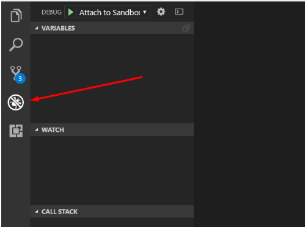

2. In the dropdown list at the top choose "Add configuration":
    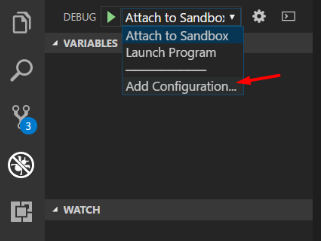

3. Right after launch.json should be automatically opened and a list of possible configurations shown. Choose "Demandware Debugger", check default values of launch.json - you should see something like at the screen below, and save the file:

    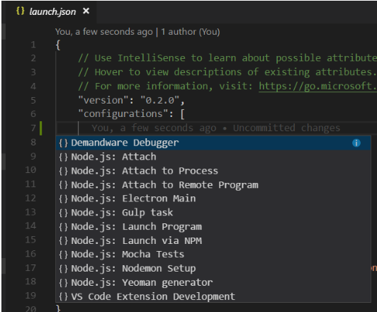
    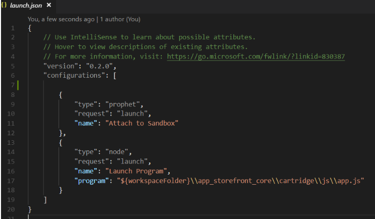


4. Now the debugger should be configured and ready to use.


**3. Start a Debugging Session**   
   1. On the Debugger tab in the dropdown list at the top choose your demandware configuration and start a debugging session (press the green arrow or F5). Debugger panel should appear at the top and a message about successful connection should be printed in the Debug Console at the bottom.

        

   2. Open ShowProduct controller in VSC and add breakpoint on some of variables declaration lines. It should also appear in Breakpoints section in VSC.
        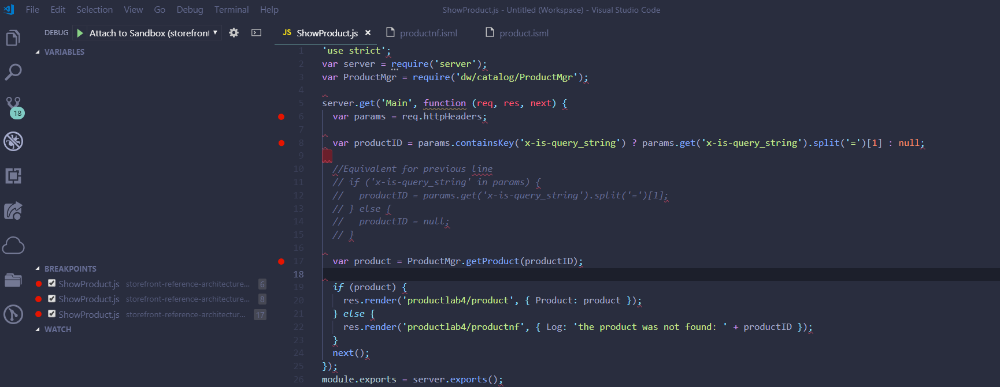

   3. In a browser call ShowProduct-Start endpoint with random product ID like 123456, the url should look like: "...dware.net/on/demandware.store/Sites-RefArch-Site/en_US/ShowProduct-Main?product=4"
   4. After url entered debugger will catch the breakpoint, stop execution and show current variables:
        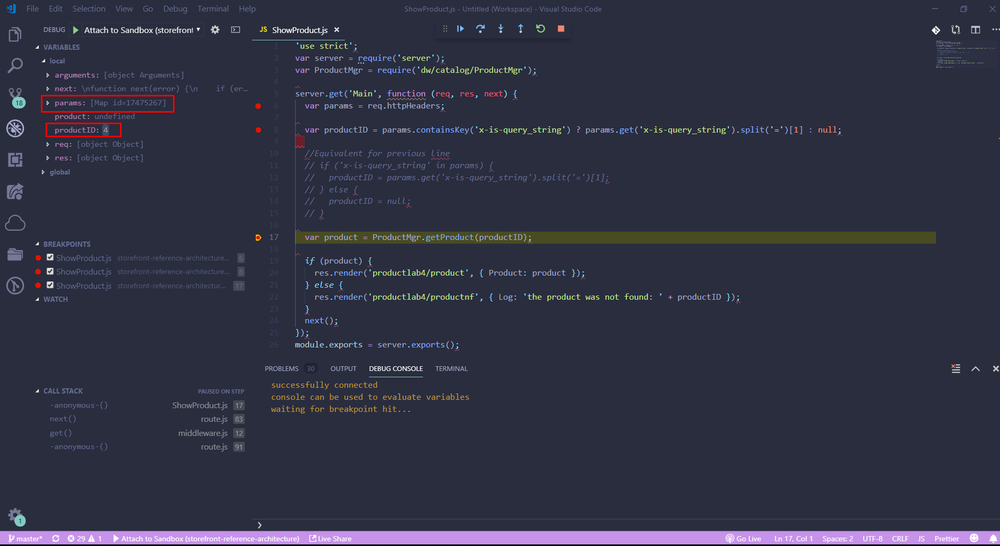


   5. Press F5 to continue execution. Since you have no templates created, execution should finish with an error (you can see it's details in Request Log).

## Lab4: Controllers extend


Use the module.superModule mechanism to import the functionality from a controller and then override or add to it.

In this example, the Product.js controller uses the following APIs for customization:

module.superModule: Imports functionality from the first controller with the same name and location found to the right of the current cartridge on the cartridge path.

server.extend: Inherits the existing server object and extends it with a list of new routes from the super module. In this case, it adds the routes from the module.superModule Project.js file.

server.append: Modifies the Show route by appending middleware that adds properties to the viewData object for rendering. Using server.append causes a route to execute both the original middleware chain and any additional steps. If you're interacting with a web service or third-party system, don’t use server.append.

res.getViewData: Gets the current viewData object from the response object.

res.setViewData: Updates the viewData object used for rendering the template. Create your customized template in the same location and with the same name as the template rendered by the superModule controller. For example, if this controller inherits functionality from app_storefront_base, the rendering template depends on the product type being rendered. The rendering template can be either product/productDetails, product/bundleDetails, or product/setDetails.

```javascript
// Product.js

'use strict';

var server = require('server');
var page = module.superModule;        //inherits functionality from next Product.js found to the right on the cartridge path
server.extend(page);                  //extends existing server object with a list of new routes from the Product.js found by module.superModule

server.append('Show', function (req, res, next) { //adds additional middleware
    var viewData = res.getViewData();
    viewData.product.reviews = [{
        text: 'Lorem ipsum dolor sit amet, cibo utroque ne vis, has no sumo graece.' +
          ' Dicta persius his id. Ea maluisset scripserit contentiones quo, est ne movet dicam.' +
          ' Equidem scriptorem vis no. Civibus tacimates interpretaris has et,' +
          ' ei offendit ocurreret vis, eos purto pertinax eleifend ea.',
        rating: 3.5
    }, {
        text: 'Very short review',
        rating: 5
    }, {
        text: 'Lorem ipsum dolor sit amet, cibo utroque ne vis, has no sumo graece.',
        rating: 1.5
    }];

    res.setViewData(viewData);
    next();
});

module.exports = server.exports();
```


## Lab5: Templates

1. Create ISML template lab4/product.isml which shows the name of the Product. For this we use name property of the Product object, passed to the template by the controller:
      ```javascript
    <html>
        <head>
            <title>${ Resource.msg('Hello') }</title>
        </head>
        <body>
            <h1>${JSON.stringify(pdict.Product)}</h1>
        </body>
    </html>
    ```

2. Create ISML template lab4/productnotfound.isml with some simple text describing that the system can't find such product.

    ```javascript
    <html>
        <head>
            <title>${ Resource.msg('Hello') }</title>
        </head>
        <body>
            <h1>${pdict.Log}</h1>
        </body>
    </html>
    ```
3. Request the ShowProduct-Start controller appending a URL query string containing the product id: ShowProduct-Start?product=54399.
4. Debug and verify.
        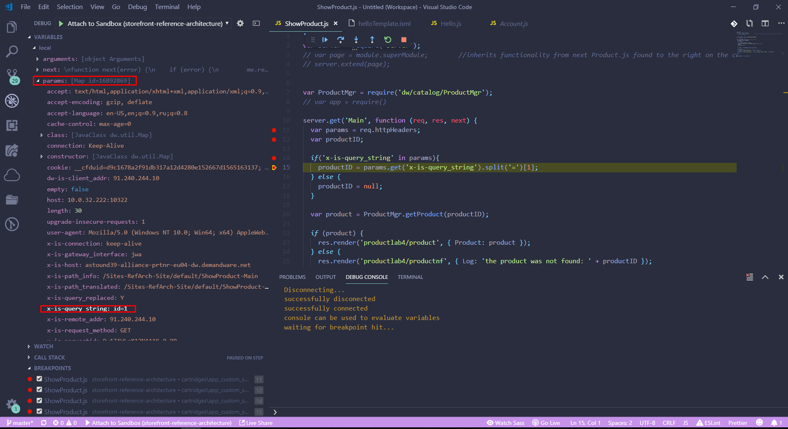
5. Commit and Push to new branch, create Pull Request

## Lab6: Script Debugging

In this lab we summarize all work done in 4 previous WTs. You need to find in BM some product's ID, to form a proper request string and to debug the execution of the controller for both existing and nonexisting (in the catalog) product ID.

1. Go to *BM* ⇒ *Site Genesis* ⇒ *Merchant Tools* ⇒ *Products And Catalogs* ⇒ *Products* find any product and get it's ID.
2. Run the controller with a valid product in the query string, for example:
   http://your-sandbox-name-dw.demandware.net/on/demandware.store/Sites-RefArch-Site/en_US/ShowProduct-Main?product=4 (replace "your-sandbox-name" with a proper domain name of your sandbox).

   Verify that the product name appears.

3. Debug the ShowProduct script:
   1. In your IDE go into the debugging mode, start debugging session.
   2. Add some breakpoints in the ShowProduct-Start controller.
   3. Call the controller in a browser using proper query string.
   4. Step over all the code in the script (use F5 or F6).
   5. Execute through the end of the controller (F8).


4. Call ShowProduct-Start on browser for some invalid product ID, verify if proper message appears.


5. Commit and Push to new branch, create Pull Request


## Lab7: Reusing Code with a Decorator

One more good way to reuse existing code is to use decorators. Decorator is an ISML template with which some content could be wrapped. Decorators are typically named with "pt_" prefix. In this WT you need to wrap a template with a decorator, to verify it's work and to find decorators used on the page using Storefront Toolkit.

1. Study an existing Decorator.
   1. Locate the common/layout/page template.
   2. Notice the different areas of the page this decorator defines.
   3. Locate and study the  *isreplace*  tag.
2. Using a Decorator.
   1. Open the product.isml template, which you rendered in ShowProduct controller.
   2. In the product.isml, add the common/layout/page decorator so it wraps the existing content on the page:

    ```html
        <isdecorate template="common/layout/page">
            <isscript>
                var assets = require('*/cartridge/scripts/assets');
                assets.addJs('/js/productTile.js');
                assets.addCss('/css/product/detail.css')
            </isscript>
            //existing content in product.isml
        </isdecorate>
    ```

   3.  Test the controller with an existing product:
    [your-sandbox-name-dw.demandware.net/on/demandware.store/Sites-RefArch-Site/default/ShowProduct-Start?product=008884303989](http://your-sandbox-name-dw.demandware.net/on/demandware.store/Sites-RefArch-Site/default/ShowProduct-Start?product=008884303989)


3. Finding a Decorator used on a page:
   1. In the Storefront Toolkit, locate the Page Information tool and select it.
        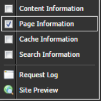
   2. Mouse over the page to see the templates used to render areas of the page. For example:
        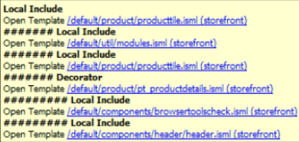
   3. Click one of the links to navigate to a specific template, i.e. the decorator. Expected result: the decorator file opens in Studio.
   4. Back in the browser, select the Cache Information tool from the Storefront Toolkit.
        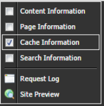
   5. Inspect the caching used for different templates in the page.
   6. Click on one of the links to open that file in Studio.
   7. Click the Esc key to exit the toolkit behavior.


<!-- 
## Lab6: Reusing Code with a Local Include

It is sometimes very helpful to use existing templates in your template so you don't need to repeat some commonly used parts of isml code. This could be easily done with the help of Local or Remote includes.
In this lab you need to use local include of producttile template to add some visualization to the product template.

1. Study the template to be Included.
   1. Locate and study the productTile.isml template (CTRL+SHIFT+R for Eclipse, Ctrl+P for VSC).
   2. Notice that the first *isset* tag expects pdict.product.


2. Using a Local Include
   1. Open the ShowProduct controller.
   2. Debug and find name attribute of Product (it shouldn't be equall to null).
   3. Open the product.isml template. In the template:
      1. Create a variable that matches the variable and scope expected in the productTile.isml template (it expects pdict.product variable): 


      ```html
      <isset name="product" value="${pdict.Product}" scope="pdict"/>
      ```
       1. Use a local include to display the product tile below the product name:

        ```javascript
        <isinclude template="product/producttile"/>
        ```

        1. Test the controller with an existing product: ...ShowProduct-Start?product=008884303989.
        2. Commit and Push to new branch feature/WT3.1 , create Pull Request


 -->


## Lab8: Middleware


Each step of a middleware chain is a function that takes three arguments: req, res, and next, in that order.

**req**

This argument is short for Request. It contains information about the server request that initiated execution. The req object contains user input information, such as the content-type that the user accepts, the user's login and locale information, or session information. The req argument parses query string parameters and assigns them to the req.querystring object.

**res**

This argument is short for Response. It contains functionality for outputting data back to the client. For example:

- res.cacheExpiration(24): Sets cache expiration to 24 hours from now.
- res.render(templateName, data): Outputs an ISML template back to the client and assigns data to pdict.
- res.json(data): Prints a JSON object back to the screen. It's helpful in creating AJAX service endpoints that you want to execute from the client-side scripts.
- res.setViewData(data): Doesn't render anything, but sets the output object. This behavior can be helpful if you want to add multiple objects to the pdict of the template. The pdict contains the information for rendering that is passed to the template. setViewData merges all the data that you passed into a single object, so you can call it at every step of the middleware chain. For example, you can create a separate middleware function that retrieves information about a user's locale to render a language switch on the page. The output object of the ISML template or JSON is set after every step of the middleware chain is complete.

You can also use the ViewData object to extend the data created in a controller that you are extending. You don't have to duplicate the logic used in the original controller to get the data. You only have to add the additional data to the ViewData object and render it.

**next()**

Executing the next function notifies the server that you are done with a middleware step so that it can execute the next step in the chain.

By chaining multiple middleware functions, you can compartmentalize your code and extend or modify routes without having to rewrite them.

**Example 1: Conditionally Executing a Middleware Step**

This example shows a main function that conditionally executes next()or next(new Error()) depending on whether an Apple Pay order is being placed.
```javascript
server.post('Submit', function (req, res, next) {
    var order = OrderMgr.getOrder(req.querystring.order_id);

    if (!order && req.querystring.order_token !== order.getOrderToken()) {
        return next(new Error('Order token does not match'));
    }

    var orderPlacementStatus = orderHelpers.placeOrder(order);

    if (orderPlacementStatus.error) {
        return next(new Error('Could not place order'));
    }

    var orderModel = orderHelpers.buildOrderModel(order);
    res.render('checkout/confirmation/confirmation', { order: orderModel });
    return next();
});
```

The code executed between the first and last parameter is referred to as middleware and the entire process is called chaining. You can create middleware functions to limit route access, add information to the data object passed to the template for rendering, or for any other purpose. One limitation to this approach is that you must call the next function at the end of every step in the chain. Otherwise, the next function in the chain is not executed.


**Event Emitters**

The server module emits events at every step of execution and you can subscribe and unsubscribe to events from a given route. Use an event emitter to override the middleware chain by removing the event listener and creating a new one. However, if you have to change individual steps in a middleware chain, we recommend that you replace a route. While SFRA does supply removeListener and removeAllListener functions, they don't recognize named event emitters. For this reason, it isn't possible to use Step event emitters to override a specific step in the middleware chain.

The following is a list of currently supported events:

- route:BeforeComplete is emitted before the route:Complete event but after all middleware functions. Used to store user submitted data to the database; most commonly in forms.
- route:Complete is emitted after all steps in the chain finish execution. Subscribed to by the server to render ISML or JSON back to the client.
- route:Redirect is emitted before res.redirect execution.
- route:Start is emitted as before middleware chain execution.
- route:Step is emitted before execution of each step in the middleware chain.
All events provide both req and res as parameters to all handlers.

Subscribing or unsubscribing to an event lets you do complex and interesting things. For example, the server subscribes to the route:Complete event to render ISML back to the client. If you want to use something other than ISML to render the content of your template, you can unsubscribe from the route:Complete event. You can subscribe to it again with a function that uses your own rendering engine instead of ISML, without modifying any of the existing controllers.

**OnRequest and OnSession Event Handlers**

The OnRequest and OnSession event handlers that were implemented as pipelines in SiteGenesis Pipeline Processor (SGPP) and as controllers in SGJC are not used in SFRA. You still have access to request and session data using the middleware req (request) and res (response) objects. However, SFRA avoids using OnRequest and OnSession anywhere in our code outside of the server module.

If you want to implement OnRequest and OnSession, they must be implemented through hooks. B2C Commerce looks for OnSession as the controller name, but the new architecture doesn't do that. The only difference between a hook and controller is that the hook doesn't have access to the req and res objects.


**Inheriting Functionality from Another Controller and Extending It**

It's important to understand when to extend a controller and when to override it, because this decision can significantly impact functionality and performance.

**When do I want to Override?**

It's best to override if you want to avoid executing the middleware of the controller or script you're modifying.

When extending a controller, you first execute the original middleware, and then execute the additional steps included in your extension. If the original middleware steps include interaction with a third-party system, that interaction is still executed. If your extension also includes the interaction, the interaction is executed twice. Similarly, if the original middleware includes one or more steps that are computationally expensive, you can avoid executing the original middleware.

**When do I want to Extend?**

If the middleware you want to override is looking up a string or performing inexpensive operations, you can extend the controller or module.

**How do I extend or Override?**

Use the module.superModule mechanism to import the functionality from a controller and then override or add to it.


**Example: Adding Product Reviews to Product.Js**

This example customizes the product detail page to include product review information. The code for this example is available in the Plugin_reviews demo cartridge.

In this example, the Product.js controller uses the following APIs for customization:
- module.superModule: Imports functionality from the first controller with the same name and location found to the right of the current cartridge on the cartridge path.
- server.extend: Inherits the existing server object and extends it with a list of new routes from the super module. In this case, it adds the routes from the module.superModule Project.js file.
- server.append: Modifies the Show route by appending middleware that adds properties to the viewData object for rendering. Using server.append causes a route to execute both the original middleware chain and any additional steps. If you're interacting with a web service or third-party system, don’t use server.append.
- res.getViewData: Gets the current viewData object from the response object.
- res.setViewData: Updates the viewData object used for rendering the template. Create your customized template in the same location and with the same name as the template rendered by the superModule controller. For example, if this controller inherits functionality from app_storefront_base, the rendering template depends on the product type being rendered. The rendering template can be either product/productDetails, product/bundleDetails, or product/setDetails.


```javascript
// Product.js

'use strict';

var server = require('server');
var page = module.superModule;        //inherits functionality from next Product.js found to the right on the cartridge path
server.extend(page);                  //extends existing server object with a list of new routes from the Product.js found by module.superModule

server.append('Show', function (req, res, next) { //adds additional middleware
    var viewData = res.getViewData();
    viewData.product.reviews = [{
        text: 'Lorem ipsum dolor sit amet, cibo utroque ne vis, has no sumo graece.' +
          ' Dicta persius his id. Ea maluisset scripserit contentiones quo, est ne movet dicam.' +
          ' Equidem scriptorem vis no. Civibus tacimates interpretaris has et,' +
          ' ei offendit ocurreret vis, eos purto pertinax eleifend ea.',
        rating: 3.5
    }, {
        text: 'Very short review',
        rating: 5
    }, {
        text: 'Lorem ipsum dolor sit amet, cibo utroque ne vis, has no sumo graece.',
        rating: 1.5
    }];

    res.setViewData(viewData);
    next();
});

module.exports = server.exports();
```


**Replacing or Adding a Route** 

If you want to completely replace a route, rather than append it, use module.superModule to inherit the functionality of the controller and route you want to replace. Then register the functions you want the route to use.

**Example: replacing the Product-Varation route**

In your custom cartridge, create a Product.js file in the same location as the Product.js file in the base cartridge. Use the following code to import the functionality of Product.js and redefine it.

```javascript
var page = require('app_storefront_base/cartridge/controller/Product');
var server = require('server);

server.extend(page);

server.replace('Show', server.middleware.get, function(req, res, next){
    res.render('myNewTemplate');
    next();
});

```


**Overriding Instead of Replacing a Step in the Middleware Chain**

You can use the middleware functions provided by Commerce Cloud or create your own. We recommend that you replace a route when changing access.

These middleware filtering functions are provided by Commerce Cloud:

 - get: Filter for get requests
 - htt: Filter for http requests
 - https: Filter for https requests
 - include: Filter for remote includes
 - post: Filter for post requests

If the request doesn't match the filtering condition, the function returns an Error with the text Params do not match route.


**Discovering deeply 'cartridge/scripts/middleware'**

**1. https access**
   
You can enhance this code by adding the server.middleware.https parameter after Show, to limit this route to only allow HTTPS requests. This example restricts the Account-Show route to HTTPS.

```javascript

'use strict';

var server = require('server');    //the server module is used by all controllers
var cache = require('*/cartridge/scripts/middleware/cache');

server.get('Show', server.middleware.https, function (req, res, next) {  //registers the Show route for the Home module
    res.render('/home/homepage');      //renders the hompage template
    next();            //notifies middleware chain that it can move to the next step or terminate if this is the last step.
});

module.exports = server.exports();
```

**2. cache**

2.1 cache.applyDefaultCache - Applies the default expiration value for the page cache.
```javascript

'use strict';

var server = require('server');    //the server module is used by all controllers
var cache = require('*/cartridge/scripts/middleware/cache');

server.get('Show', cache.applyDefaultCache, server.middleware.https, function (req, res, next) {  //registers the Show route for the Home module
    res.render('/home/homepage');      //renders the hompage template
    next();            //notifies middleware chain that it can move to the next step or terminate if this is the last step.
});

module.exports = server.exports();
```

2.2 cache.applyPromotionSensitiveCache - Applies the default price promotion page cache.
```javascript

'use strict';

var server = require('server');    //the server module is used by all controllers
var cache = require('*/cartridge/scripts/middleware/cache');

server.get('Show', cache.applyPromotionSensitiveCache, server.middleware.https, function (req, res, next) {  //registers the Show route for the Home module
    res.render('/home/homepage');      //renders the hompage template
    next();            //notifies middleware chain that it can move to the next step or terminate if this is the last step.
});

module.exports = server.exports();
```

2.3 cache.applyShortPromotionSensitiveCache - Applies the default price promotion page cache.
```javascript

'use strict';

var server = require('server');    //the server module is used by all controllers
var cache = require('*/cartridge/scripts/middleware/cache');

server.get('Show', cache.applyShortPromotionSensitiveCache, server.middleware.https, function (req, res, next) {  //registers the Show route for the Home module
    res.render('/home/homepage');      //renders the hompage template
    next();            //notifies middleware chain that it can move to the next step or terminate if this is the last step.
});

module.exports = server.exports();
```

2.4 cache.applyInventorySensitiveCache -  Applies the inventory sensitive page cache.
```javascript

'use strict';

var server = require('server');    //the server module is used by all controllers
var cache = require('*/cartridge/scripts/middleware/cache');

server.get('Show', cache.applyInventorySensitiveCache, server.middleware.https, function (req, res, next) {  //registers the Show route for the Home module
    res.render('/home/homepage');      //renders the hompage template
    next();            //notifies middleware chain that it can move to the next step or terminate if this is the last step.
});

module.exports = server.exports();
```

3. consentTracking

Middleware to use consent tracking check

```javascript
'use strict';

var server = require('server');    //the server module is used by all controllers
var consentTracking = require('*/cartridge/scripts/middleware/consentTracking');

server.get('Show', consentTracking.consent, server.middleware.https, function (req, res, next) {  //registers the Show route for the Home module
    res.render('/home/homepage');      //renders the hompage template
    next();            //notifies middleware chain that it can move to the next step or terminate if this is the last step.
});

module.exports = server.exports();
```

4. pageMetaData - Middleware to compute request pageMetaData object

```javascript
'use strict';

var server = require('server');    //the server module is used by all controllers
var pageMetaData = require('*/cartridge/scripts/middleware/pageMetaData');

server.get('Show', pageMetaData.computedPageMetaData, server.middleware.https, function (req, res, next) {  //registers the Show route for the Home module
    res.render('/home/homepage');      //renders the hompage template
    next();            //notifies middleware chain that it can move to the next step or terminate if this is the last step.
});

module.exports = server.exports();
```

```html
<iscontent type="text/html" charset="UTF-8" compact="true" />

<html>
    <head>
        <title>${ Resource.msg('Home') }</title>
    </head>
    <body>
        <span> ${pdict.CurrentPageMetaData.title }</span>
        <span> ${pdict.CurrentPageMetaData.description }</span>
        <span> ${pdict.CurrentPageMetaData.keywords }</span>
        <span> ${pdict.CurrentPageMetaData.pageMetaTags }</span>
    </body>
</html>
```

5. userLoggedIn 

5.1 validateLoggedIn - Middleware validating if user logged in
```javascript
'use strict';

var server = require('server');    //the server module is used by all controllers
var userLoggedIn = require('*/cartridge/scripts/middleware/userLoggedIn');

server.get('Show', userLoggedIn.validateLoggedIn, server.middleware.https, function (req, res, next) {  //registers the Show route for the Home module
    res.render('/home/homepage');      //renders the hompage template
    next();            //notifies middleware chain that it can move to the next step or terminate if this is the last step.
});

module.exports = server.exports();
```

5.2 validateLoggedInAjax - Middleware validating if user logged in from ajax request

```javascript
'use strict';

var server = require('server');    //the server module is used by all controllers
var userLoggedIn = require('*/cartridge/scripts/middleware/userLoggedIn');

server.get('Show', userLoggedIn.validateLoggedInAjax, server.middleware.https, function (req, res, next) {  //registers the Show route for the Home module
    res.render('/home/homepage');      //renders the hompage template
    next();            //notifies middleware chain that it can move to the next step or terminate if this is the last step.
});

module.exports = server.exports();
```

6. csrf

6.1 validateRequest - Middleware validating CSRF token
```javascript
'use strict';

var server = require('server');    //the server module is used by all controllers
var csrf = require('*/cartridge/scripts/middleware/csrf');

server.get('Show', csrf.validateRequest, server.middleware.https, function (req, res, next) {  //registers the Show route for the Home module
    res.render('/home/homepage');      //renders the hompage template
    next();            //notifies middleware chain that it can move to the next step or terminate if this is the last step.
});

module.exports = server.exports();
```
6.2 validateAjaxRequest - Middleware validating CSRF token from ajax request
```javascript
'use strict';

var server = require('server');    //the server module is used by all controllers
var csrf = require('*/cartridge/scripts/middleware/csrf');

server.get('Show', csrf.validateAjaxRequest, server.middleware.https, function (req, res, next) {  //registers the Show route for the Home module
    res.render('/home/homepage');      //renders the hompage template
    next();            //notifies middleware chain that it can move to the next step or terminate if this is the last step.
});

module.exports = server.exports();
```

6.3 generateToken - Middleware generating a csrf token and setting the view data
```javascript
'use strict';

var server = require('server');    //the server module is used by all controllers
var csrf = require('*/cartridge/scripts/middleware/csrf');

server.get('Show', csrf.generateToken, function (req, res, next) {  //registers the Show route for the Home module
    res.render('/home/homepage');      //renders the hompage template
    next();            //notifies middleware chain that it can move to the next step or terminate if this is the last step.
});

module.exports = server.exports();
```

```html
<iscontent type="text/html" charset="UTF-8" compact="true" />

<html>
    <head>
        <title>${ Resource.msg('Home') }</title>
    </head>
    <body>
        <span> ${pdict.csrf.tokenName }</span>
        <span> ${pdict.csrf.token }</span>
       
    </body>
</html>
```

## Lab9: Models and js decorators

Models are serializable JSON objects. A model takes the object as a parameter and construct itself by retrieving neccesery information from the object. The model applies bussiness logic while it's doing the convertion to represent information in a usable format. Some models are complicated, for example Product is the most complicated model in the SFRA. There are several varities of products such as Product, ProductBundle, ProductLineItem,  ProductSet etc. To make it easier for you to customize the features, that are available we use decorator patterns. A decorator pattern is a standart development approach when you have to decorate an object with the set of attributes and/or actions. Each attribute is a separate decorator and is applied to the object to add functionality. We use a decorator pattern for more complicated models to separate functionality and allow you to easily supstitude it for different functionality where needed. Different models such as Product, ProductBundle,  ProductSet share the same decorators, for example the productImages decorator is shared amongst Product, ProductBundle,  ProductSet models. If you need to change how the images are retrieved from the system, for example if you want to store images on an external server instead of using the bussiness manager you only have to change imagedecorator and all models that are also using it will have the new information.
        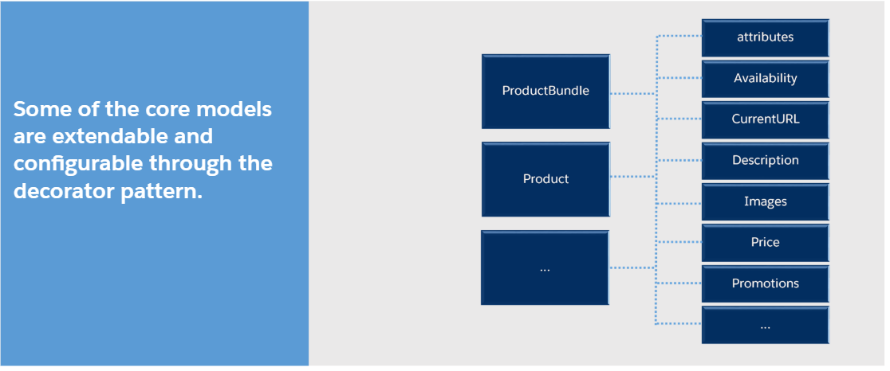

To see how it works go to: */cartridge/models/product/decorators/index.js where are imporrted all decorator in the folder. Discover some of them, for example base.js decorator.

```javascript
'use strict';

module.exports = function (object, apiProduct, type) {
    Object.defineProperty(object, 'uuid', {
        enumerable: true,
        value: apiProduct.UUID
    });

    Object.defineProperty(object, 'id', {
        enumerable: true,
        value: apiProduct.ID
    });

    Object.defineProperty(object, 'productName', {
        enumerable: true,
        value: apiProduct.name
    });

    Object.defineProperty(object, 'productType', {
        enumerable: true,
        value: type
    });

    Object.defineProperty(object, 'brand', {
        enumerable: true,
        value: apiProduct.brand
    });
};
```

The go to fullProduct.js in product folder. And check the usage out.

```javascript
'use strict';

var decorators = require('*/cartridge/models/product/decorators/index');

/**
 * Decorate product with full product information
 * @param {Object} product - Product Model to be decorated
 * @param {dw.catalog.Product} apiProduct - Product information returned by the script API
 * @param {Object} options - Options passed in from the factory
 * @property {dw.catalog.ProductVarationModel} options.variationModel - Variation model returned by the API
 * @property {Object} options.options - Options provided on the query string
 * @property {dw.catalog.ProductOptionModel} options.optionModel - Options model returned by the API
 * @property {dw.util.Collection} options.promotions - Active promotions for a given product
 * @property {number} options.quantity - Current selected quantity
 * @property {Object} options.variables - Variables passed in on the query string
 *
 * @returns {Object} - Decorated product model
 */
module.exports = function fullProduct(product, apiProduct, options) {
    decorators.base(product, apiProduct, options.productType);
    decorators.price(product, apiProduct, options.promotions, false, options.optionModel);

    if (options.variationModel) {
        decorators.images(product, options.variationModel, { types: ['large', 'small'], quantity: 'all' });
    } else {
        decorators.images(product, apiProduct, { types: ['large', 'small'], quantity: 'all' });
    }

    decorators.quantity(product, apiProduct, options.quantity);
    decorators.variationAttributes(product, options.variationModel, {
        attributes: '*',
        endPoint: 'Variation'
    });
    decorators.description(product, apiProduct);
    decorators.ratings(product);
    decorators.promotions(product, options.promotions);
    decorators.attributes(product, apiProduct.attributeModel);
    decorators.availability(product, options.quantity, apiProduct.minOrderQuantity.value, apiProduct.availabilityModel);
    decorators.options(product, options.optionModel, options.variables, options.quantity);
    decorators.quantitySelector(product, apiProduct.stepQuantity.value, options.variables, options.options);

    var category = apiProduct.getPrimaryCategory();
    if (!category && options.productType !== 'master') {
        category = apiProduct.getMasterProduct().getPrimaryCategory();
    }

    if (category) {
        decorators.sizeChart(product, category.custom.sizeChartID);
    }

    decorators.currentUrl(product, options.variationModel, options.optionModel, 'Product-Show', apiProduct.ID, options.quantity);
    decorators.readyToOrder(product, options.variationModel);
    decorators.online(product, apiProduct);
    decorators.raw(product, apiProduct);
    decorators.pageMetaData(product, apiProduct);
    decorators.template(product, apiProduct);

    return product;
};

```

Then this model is imported and used in scripts: 

```javascript
'use strict';

var ProductMgr = require('dw/catalog/ProductMgr');
var PromotionMgr = require('dw/campaign/PromotionMgr');
var productHelper = require('*/cartridge/scripts/helpers/productHelpers');
var productTile = require('*/cartridge/models/product/productTile');
var bonusProduct = require('*/cartridge/models/product/bonusProduct');
var fullProduct = require('*/cartridge/models/product/fullProduct');
var productSet = require('*/cartridge/models/product/productSet');
var productBundle = require('*/cartridge/models/product/productBundle');
var productLineItem = require('*/cartridge/models/productLineItem/productLineItem');
var bonusProductLineItem = require('*/cartridge/models/productLineItem/bonusProductLineItem');
var bundleProductLineItem = require('*/cartridge/models/productLineItem/bundleLineItem');
var orderLineItem = require('*/cartridge/models/productLineItem/orderLineItem');
var bonusOrderLineItem = require('*/cartridge/models/productLineItem/bonusOrderLineItem');
var bundleOrderLineItem = require('*/cartridge/models/productLineItem/bundleOrderLineItem');

module.exports = {
    get: function (params) {
        var productId = params.pid;
        var product = Object.create(null);
        var apiProduct = ProductMgr.getProduct(productId);
        if (apiProduct === null) {
            return product;
        }
        var productType = productHelper.getProductType(apiProduct);
        var options = null;
        var promotions;

        switch (params.pview) {
            case 'tile':
                product = productTile(product, apiProduct, productType);
                break;
            case 'bonusProductLineItem':
                promotions = PromotionMgr.activeCustomerPromotions.getProductPromotions(apiProduct);
                options = {
                    promotions: promotions,
                    quantity: params.quantity,
                    variables: params.variables,
                    lineItem: params.lineItem,
                    productType: productType
                };

                switch (productType) {
                    case 'bundle':
                        // product = bundleProductLineItem(product, apiProduct, options, this);
                        break;
                    default:
                        var variationsBundle = productHelper.getVariationModel(apiProduct, params.variables);
                        if (variationsBundle) {
                            apiProduct = variationsBundle.getSelectedVariant() || apiProduct; // eslint-disable-line
                        }

                        var optionModelBundle = apiProduct.optionModel;
                        var optionLineItemsBundle = params.lineItem.optionProductLineItems;
                        var currentOptionModelBundle = productHelper.getCurrentOptionModel(
                            optionModelBundle,
                            productHelper.getLineItemOptions(optionLineItemsBundle, productId)
                        );
                        var lineItemOptionsBundle = optionLineItemsBundle.length
                            ? productHelper.getLineItemOptionNames(optionLineItemsBundle)
                            : productHelper.getDefaultOptions(optionModelBundle, optionModelBundle.options);


                        options.variationModel = variationsBundle;
                        options.lineItemOptions = lineItemOptionsBundle;
                        options.currentOptionModel = currentOptionModelBundle;

                        if (params.containerView === 'order') {
                            product = bonusOrderLineItem(product, apiProduct, options);
                        } else {
                            product = bonusProductLineItem(product, apiProduct, options);
                        }

                        break;
                }

                break;
            case 'productLineItem':
                promotions = PromotionMgr.activeCustomerPromotions.getProductPromotions(apiProduct);
                options = {
                    promotions: promotions,
                    quantity: params.quantity,
                    variables: params.variables,
                    lineItem: params.lineItem,
                    productType: productType
                };

                switch (productType) {
                    case 'bundle':

                        if (params.containerView === 'order') {
                            product = bundleOrderLineItem(product, apiProduct, options, this);
                        } else {
                            product = bundleProductLineItem(product, apiProduct, options, this);
                        }
                        break;
                    default:
                        var variationsPLI = productHelper.getVariationModel(apiProduct, params.variables);
                        if (variationsPLI) {
                            apiProduct = variationsPLI.getSelectedVariant() || apiProduct; // eslint-disable-line
                        }

                        var optionModelPLI = apiProduct.optionModel;
                        var optionLineItemsPLI = params.lineItem.optionProductLineItems;
                        var currentOptionModelPLI = productHelper.getCurrentOptionModel(
                            optionModelPLI,
                            productHelper.getLineItemOptions(optionLineItemsPLI, productId)
                        );
                        var lineItemOptionsPLI = optionLineItemsPLI.length
                            ? productHelper.getLineItemOptionNames(optionLineItemsPLI)
                            : productHelper.getDefaultOptions(optionModelPLI, optionModelPLI.options);


                        options.variationModel = variationsPLI;
                        options.lineItemOptions = lineItemOptionsPLI;
                        options.currentOptionModel = currentOptionModelPLI;

                        if (params.containerView === 'order') {
                            product = orderLineItem(product, apiProduct, options);
                        } else {
                            product = productLineItem(product, apiProduct, options);
                        }

                        break;
                }

                break;
            case 'bonus':
                options = productHelper.getConfig(apiProduct, params);

                switch (productType) {
                    case 'set':
                        break;
                    case 'bundle':
                        break;
                    default:
                        product = bonusProduct(product, options.apiProduct, options, params.duuid);
                        break;
                }

                break;
            default: // PDP
                options = productHelper.getConfig(apiProduct, params);

                switch (productType) {
                    case 'set':
                        product = productSet(product, options.apiProduct, options, this);
                        break;
                    case 'bundle':
                        product = productBundle(product, options.apiProduct, options, this);
                        break;
                    default:
                        product = fullProduct(product, options.apiProduct, options);
                        break;
                }
        }

        return product;
    }
};

```
 
After that it's imported to controller which for example shows us quick view of the product
```javascript
server.get('ShowQuickView', cache.applyPromotionSensitiveCache, function (req, res, next) {
    var URLUtils = require('dw/web/URLUtils');
    var productHelper = require('*/cartridge/scripts/helpers/productHelpers');
    var ProductFactory = require('*/cartridge/scripts/factories/product');
    var renderTemplateHelper = require('*/cartridge/scripts/renderTemplateHelper');
    var Resource = require('dw/web/Resource');

    var params = req.querystring;
    var product = ProductFactory.get(params);
    var addToCartUrl = URLUtils.url('Cart-AddProduct');
    var template = product.productType === 'set'
        ? 'product/setQuickView.isml'
        : 'product/quickView.isml';

    var context = {
        product: product,
        addToCartUrl: addToCartUrl,
        resources: productHelper.getResources(),
        quickViewFullDetailMsg: Resource.msg('link.quickview.viewdetails', 'product', null),
        closeButtonText: Resource.msg('link.quickview.close', 'product', null),
        enterDialogMessage: Resource.msg('msg.enter.quickview', 'product', null),
        template: template
    };

    res.setViewData(context);

    this.on('route:BeforeComplete', function (req, res) { // eslint-disable-line no-shadow
        var viewData = res.getViewData();
        var renderedTemplate = renderTemplateHelper.getRenderedHtml(viewData, viewData.template);

        res.json({
            renderedTemplate: renderedTemplate,
            productUrl: URLUtils.url('Product-Show', 'pid', viewData.product.id).relative().toString()
        });
    });

    next();
});
```

## Lab10: Creating Social Networks Links

 In this lab you need to create and add a social networks links to the product template.


- app_storefront_base/cartridge/templates/default/product/components/socialIcons.isml

Add this code to the list in the file, go to the browser and check how it works

 ```html
<li>
    <a href="https://www.google.com/search?q=${product.productName}" 
        data-share="google"
        title="${Resource.msgf('label.social.google', 'product', null, product.productName)}"
        aria-label="${Resource.msgf('label.social.google', 'product', null, product.productName)}"
        class="share-icons"
        target="_blank" >
        <i class="fa fa-google"></i>
    </a>
</li>
 ```

## Lab11: Using Page Level Caching

This walkthrough is about Page Level Caching, here you need to turn on general Caching for RefArch in BM, create a test template with iscache tag and verify if it will work properly on the storefront.

1. Enable page caching for the *RefArch* site in *Business Manager*:
   1. Administration ⇒ Sites ⇒ Manage Sites ⇒ SiteGenesis ⇒ Cache (tab). 
   2. Check Enable page caching checkbox. Click Apply.
    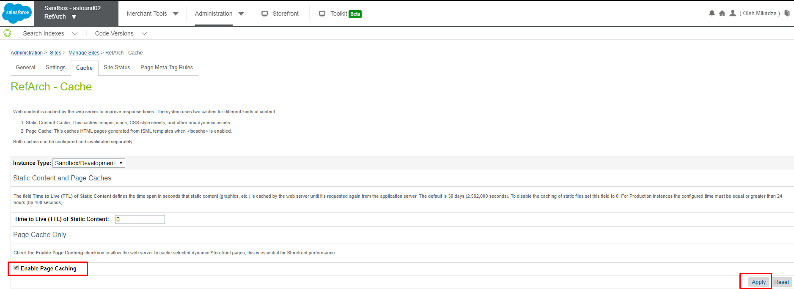
2. Create a new *Caching* controller.
   ```javascript
    'use strict';

    var server = require('server');

    server.get('Main', function (req, res, next) {
        res.render('caching/cacheTemp');
        next();
    });

    module.exports = server.exports();
   ```
3. Create a new *cachedpage.isml* template in the new folder that displays the current time:
   1. Study the  [TopLevel.Date](https://documentation.b2c.commercecloud.salesforce.com/DOC1/index.jsp?topic=%2Fcom.demandware.dochelp%2FDWAPI%2Fscriptapi%2Fhtml%2Fapi%2Fclass_TopLevel_Date.html)  class from the script API.
   2. Use the  *isprint*  tag to display the current date with *style=”DATE_TIME”* so only the time shows:

    ```javascript
    <isprint value="${Date()}" style="DATE_TIME">
    ```
4. View page without caching it: invoke the Caching-<function_name> controller multiple times, check if the time changes.
5. Cache the page and view it:
   1. Add  *iscache*  tag with a relative time of 24 hours. 
   ```javascript
   <iscache type="relative" hour="24" />
   ```
   1. Call Caching-Start multiple times: Result: the time does not change.
6. Commit and Push to new branch, create Pull Request


## Lab12: SFRA Forms

**Summary**

Task is dedicated to establish/improve/increase skills and knowledge of SFRA Forms and related functionality.

**Goals**

- Revise SFRA form's definitions;
- Revise SFRA form's validation;
- Work with form actions and build custom logic;

**Requirements**

1. Create form definition with the following items:

    1. First Name (mandatory, min length: 5, max length: 50)
    2. Last Name (mandatory, min length: 5, max length: 50)
    3. Email (mandatory, min length: 10, max length: 50, add email validation regexp)
    4. Your Comment (it can be a text area)(optional, max length: 300)
    5. Check boxes or radio buttons group which contains following items:
        - simple mode (selected by default)
        - ask a friend (in this mode, please show UI like on the attached picture)

2. Create custom controller with the related to the task logic. It should contains such parts as:
    1. clear form
    2. populate form with value
    3. validate/invalidate form
    4. interaction continue node which leads to the particular logic - according to triggered action
    5. several interaction nodes or dynamic interaction node
    6. particular interaction templates

3. Create error and successful resource messages inside the "resource/" directory in cartridge in order to display them accordingly

4. Generally, the form should be validated on the client side(please add particular min/max length values and regexp for form-item values) as well as on the server side.
Submit different form actions depending on check boxes or radio buttons values and react on triggered action accordingly.
Show error messages if form is invalid as well as successfull message after submission.

5. Actions logic:
a) simple mode - validate form (Client+Server side validation), show messages with details about entered data and finally thankful message for feedback.
b) ask a friend (in this mode, please show UI like on the attached picture) - implement extended validation for all fields and show message that you comment (lastname+first name) has been redirected/posted/shared to your friend (friend's last+first names)


**Sample**

**1. Creating a Form**

First of all you should create a "Form definition" that describes the data you need from the form, the data validation, and the system objects you want to store the data in.

- *app_custom_cartrdge/cartridge/forms/default/customForm.xml*

```javascript
    <?xml version="1.0"?>
    <form xmlns="http://www.demandware.com/xml/form/2008-04-19">

	    <field formid="firstname" label="Firstname:" type="string" mandatory="true" min-length="5" max-length="50"/>
        <field formid="lastname" label="Lastname:" type="string" mandatory="true" min-length="5" max-length="50" />
	    <field formid="email" label="Email:" type="string" mandatory="true" min-length="10" max-length="50" />
	    <field formid="comment" label="Comment:" type="string" mandatory="true" max-length="300" />

	    <action formid="submit" valid-form="true" />
    </form>
```

The form definition determines the structure of the in-memory form object. The in-memory form object persists data during the session, unless you explicitly clear the data.

In the Storefront Reference Architecture (SFRA), the first step to create a form is to create a JSON object to contain the form data. The server.getForm function uses the form definition to create this object.

Data from the form is accessible in templates using the pdict variable. However, the form is available only if the server.getForm object is passed to the template by the controller.

See also:
[ Form Definition Elements](https://documentation.b2c.commercecloud.salesforce.com/DOC1/index.jsp?topic=%2Fcom.demandware.dochelp%2FForms%2FFormDefinitionElements.html) and [ What Is a Form Definition](https://documentation.b2c.commercecloud.salesforce.com/DOC1/index.jsp?topic=%2Fcom.demandware.dochelp%2FForms%2FWhatisaformdefinition.html)


**2. Controller to Render the Form**

The controller in this example exposes a Start function that renders an empty form.The Start function sets the actionURL that's used to handle the submit action for the form and creates a JSON object based on the form definition.


- *app_custom_cartridge/cartridge/controllers/CustomPage.js*
```javascript
    'use strict';

    var server = require('server');
    var URLUtils = require('dw/web/URLUtils');

    server.get('Main', function (req, res, next) {
        var actionUrl = URLUtils.url('CustomPageResult-Show');//sets the route to call for the form submit action
        var customForm = server.forms.getForm('customForm');//creates empty JSON object using the form definition
        customForm.clear();

        res.render('custom/customPage', {
            actionUrl: actionUrl,
            customForm: customForm
        });
        next();
    });

    module.exports = server.exports();
```

See also [Using API Form Classes](https://documentation.b2c.commercecloud.salesforce.com/DOC1/index.jsp?topic=%2Fcom.demandware.dochelp%2FForms%2FUsingapiformclasses.html)


**3. Form Template**

In this example, **customPage.isml** is the empty form rendered for the user and the **customPageresult.isml** shows data entered into the form.

The client-side JavaScript and css files are included using the **assets.js** module.

The form action uses the **actionUrl** property passed to it by the controller.

- *app_custom_cartridge/cartridge/templates/default/customPage.isml*
```javascript
    <isdecorate template="common/layout/page">

        <form action="${pdict.actionUrl}" class="custom" method="POST">

            <h1>Custom forms page</h1>

            <div class="form-group required">
                <label for="firstname">First Name</label>
                <input type="text" name="firstname" id="firstname" />
            </div>

            <div class="form-group required">
                <label for="lastname">Last Name</label>
                <input type="text" name="lastname" id="lastname"/>
            </div>

            <div class="form-group required">
                <label for="email">Email</label>
                <input type="email" name="email" id="email" />
            </div>

            <div class="form-group required">
                <label for="comment">Comment</label>
                <div><textarea rows="3" cols="38" name="comment" id="comment" type="comment" ></textarea></div>
            </div>

            <div><input type="checkbox" id="checkbox1"/> <label for="checkbox1">Simple Mode</label></div>
            <div><input type="checkbox" id="checkbox2"/> <label for="checkbox2">Ask a friend</label></div>

            <div><button type="submit" class="btn btn-primary">${Resource.msg('button.text.submit', 'login', null)}</button></div>
        </form>
    </isdecorate>
```

Update the **login.properties** file(Ctrl+P to find this file globaly).
Add this line: **button.text.submit=Submit**


**3. Controller to Render Form Results**

After a form is submitted, data from the form is available as part of the **req.form** property. In the following example, the fields entered in the original form is passed to a new template for rendering.


- *app_custom_cartridge/cartridge/controllers/customPageResult.js*

```javascript
    'use strict';
    var server = require('server');
    var URLUtils = require('dw/web/URLUtils');

    server.post('Show', function (req, res, next) {

        var firstname = req.form.firstname;
        var lastname = req.form.lastname;
        var email = req.form.email;
        var comment = req.form.comment;

        res.render('custom/customPageResult', {
            firstname: firstname,
            lastname: lastname,
            email: email,
            comment: comment
        });

        next();
    });

    module.exports = server.exports();
```

**4. Form Result Template**
This template prints the form field label and data stored from the form.

- app_custom_cartridge/cartridge/templates/default/customPageResult.isml

```html
    <iscontent type="text/html" charset="UTF-8" compact="true" />
    <html>
        <body>
            <h1>Hello World from CustomForm</h1>
            <p>Nice to meet you, ${pdict.lastname}, ${pdict.firstname}. <br/> Check your email. Is it ${pdict.email}.<br/> Actually you've said that: ${pdict.comment}</p>
        </body>
    </html>
```

## Lab13: ClickStream

    Represents the click stream in the session. A maximum number of 50 clicks is recorded per session. After the maximum is reached, each time the customer clicks on a new link, the oldest click stream entry is purged. The ClickStream always remembers the first click.
    The click stream is consulted when the GetLastVisitedProducts pipelet is called to retrieve the products that the customer has recently visited.

    This class does not have a constructor, so you cannot create it directly.


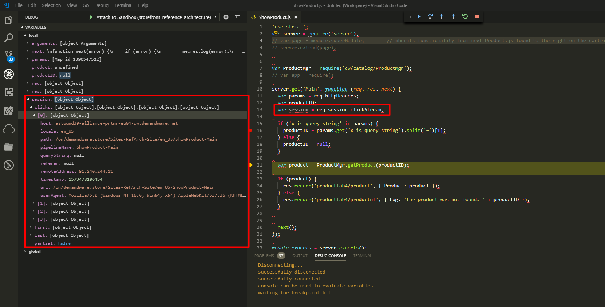

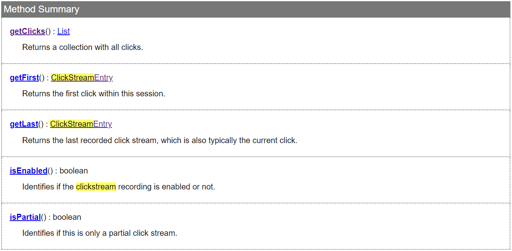
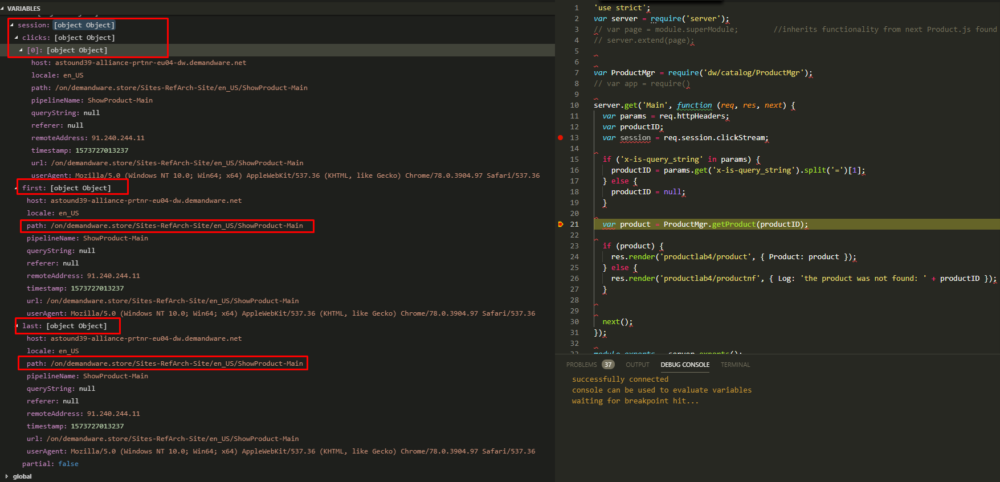


# Lab14: server.replace

    If you want to completely replace a route, rather than append it, use module.superModule to inherit the functionality of the controller and route you want to replace. Then register the functions you want the route to use.

    Example: replacing the Product-Varation route

    In your custom cartridge, create a Product.js file in the same location as the Product.js file in the base cartridge. Use the following code to import the functionality of Product.js and redefine it.
    
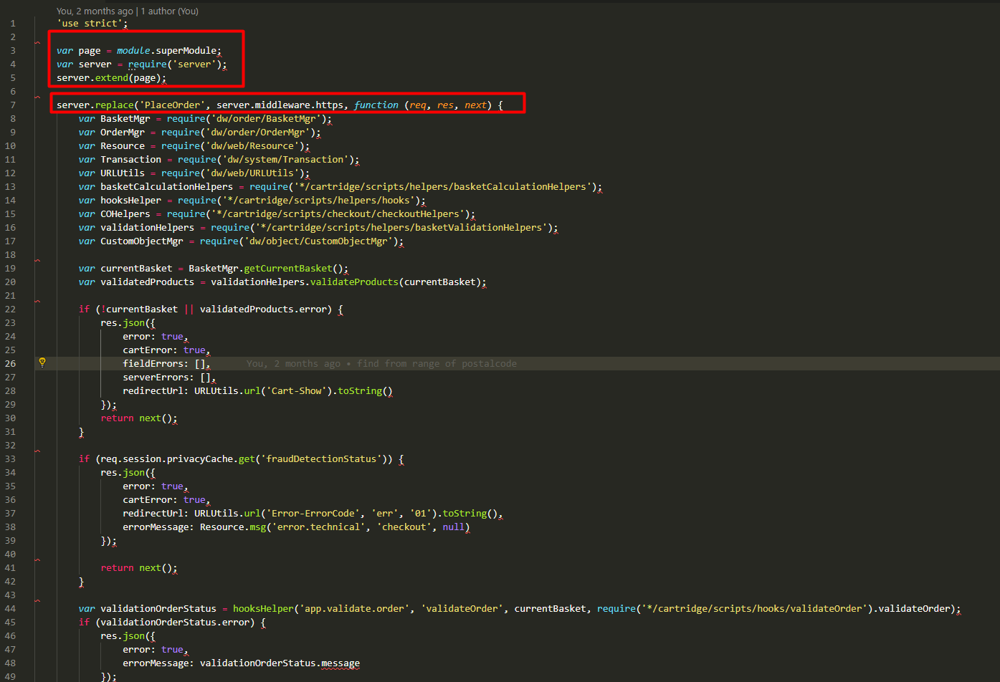